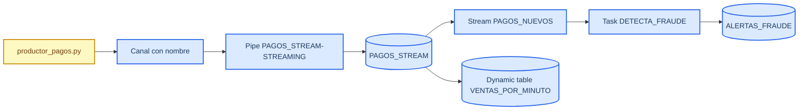
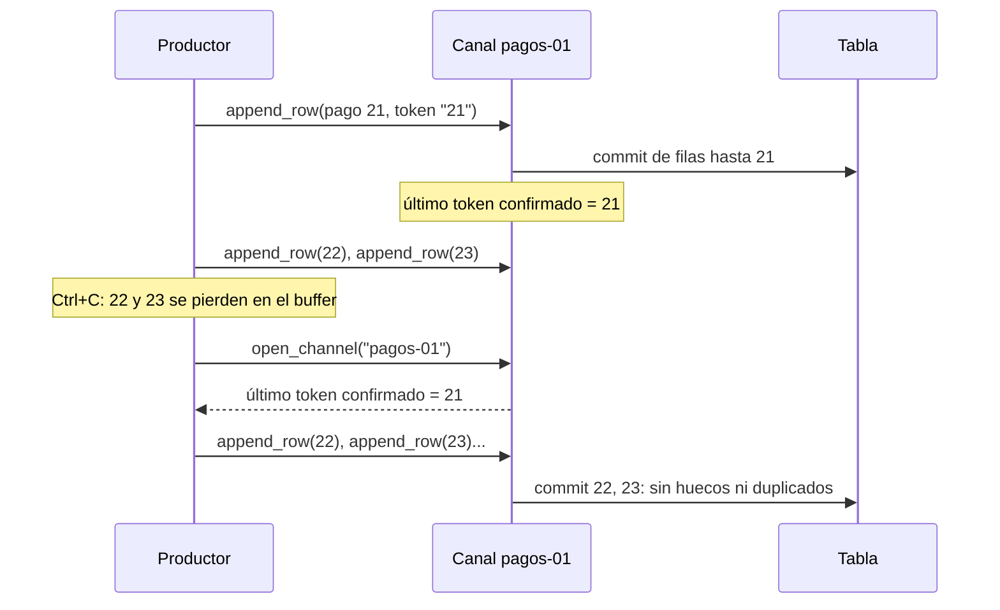

# Snowpipe Streaming Lab

_Tiempo: unos 90 minutos con el setup · Nivel: intermedio (SQL y algo de Python)_

En este laboratorio vas a mandar pagos simulados desde tu computadora a una tabla de Snowflake con Snowpipe Streaming, y los vas a ver aparecer en unos 5 segundos. Después viene la parte que importa: vas a matar el productor a la mitad, cambiarle el nombre al canal y mandarle una fila con basura, para ver con tus propios datos qué garantías da Snowflake y en qué momento dejan de cumplirse.

Cada nivel se trabaja igual. Antes de correr nada, escribe qué crees que va a pasar. Luego lo corres y comparas. Se aprende más de las predicciones que fallan que de las que aciertan.

## Lo que necesitas saber antes de empezar

Snowpipe Streaming carga filas directamente en una tabla de Snowflake, sin escribir antes un archivo en un stage. Esa es la diferencia con Snowpipe, que carga archivos cuando aparecen en un bucket. Según la documentación, el dato queda disponible para consulta entre 5 y 10 segundos después de la ingesta[^docs]. Desde septiembre de 2025 existe una versión llamada arquitectura de alto rendimiento, que es la que usa este laboratorio[^ga]. En ella las filas pasan por un objeto pipe antes de llegar a la tabla. Si no creas uno, Snowflake crea un pipe por defecto llamado `<TABLA>-STREAMING` la primera vez que un cliente abre un canal sobre esa tabla[^tutorial].

El canal es la pieza que más vas a usar. Un canal con nombre es una conexión persistente entre tu programa y una tabla. Dentro de un canal las filas se confirman en el orden en que las mandaste, y cada fila lleva un offset token: un valor que tú eliges, normalmente un número de secuencia, que Snowflake guarda junto con los datos confirmados. Cuando el programa se reinicia, le pregunta a Snowflake cuál fue el último token confirmado en ese canal y sigue desde el siguiente. Así se evita perder o duplicar filas, la garantía que Snowflake llama exactly-once. Snowflake también ofrece canales elásticos, que administra por ti y que escalan solos, pero esos garantizan solo at-least-once y no conservan el orden[^docs]. En este laboratorio usamos canales con nombre.

El costo se calcula por volumen. La ingesta de la arquitectura de alto rendimiento cuesta 0.0037 créditos por GB sin comprimir y no necesita un warehouse[^precio]. Lo que sí consume warehouse es lo que corres después, como la task y la dynamic table del nivel 5. Por eso vale la pena hacer las dos cuentas por separado.

## Cómo está armado

El productor (`productor_pagos.py`) abre un canal con nombre hacia la tabla `PAGOS_STREAM`. Snowflake crea el pipe la primera vez que alguien abre un canal sobre esa tabla, así que no tienes que crearlo tú. Del lado de Snowflake, un stream con una task detecta fraudes y una dynamic table agrega las ventas por minuto.



## Requisitos

| Necesitas | Cómo revisarlo |
| --- | --- |
| Cuenta de Snowflake con rol `ACCOUNTADMIN` (una [trial gratis](https://signup.snowflake.com) funciona) | Entra a Snowsight y mira el rol arriba a la izquierda |
| Python 3.9 o más reciente | `python3 --version` |
| `openssl` (viene con macOS y Linux; en Windows usa Git Bash) | `openssl version` |
| Este repo | `git clone` o el botón **Code → Download ZIP** |

## Setup

Toma unos 15 minutos. Si algo falla, revisa la tabla de problemas al final antes de pedir ayuda.

**1. Descarga el repo y crea el entorno de Python**

```bash
git clone https://github.com/nielspac177/snowpipe-streaming-lab.git
cd snowpipe-streaming-lab
python3 -m venv .venv
source .venv/bin/activate          # en Windows: .venv\Scripts\activate
pip install -r requirements.txt
```

**2. Genera tus llaves**

El SDK de Snowpipe Streaming no acepta usuario y contraseña, solo un par de llaves RSA.

```bash
./generar_llaves.sh
```

El script deja `rsa_key.p8` (tu llave privada) en la carpeta e imprime la llave pública en una sola línea. Copia esa línea. La privada no se comparte con nadie, y el `.gitignore` ya la deja fuera de git.

**3. Prepara Snowflake**

En Snowsight abre un worksheet de SQL nuevo y pega [`sql/00_setup.sql`](sql/00_setup.sql). Cambia `'MIIBIjANBgkq...'` por tu llave pública y ejecuta todo con Cmd/Ctrl + Shift + Enter. Si la línea `ALTER USER IDENTIFIER(CURRENT_USER())` da error, pon tu usuario a mano: `ALTER USER MI_USUARIO SET RSA_PUBLIC_KEY = '...'`.

La última consulta te devuelve tres valores, `USER`, `ACCOUNT` y `URL`. Los necesitas en el siguiente paso.

**4. Conecta el productor**

```bash
cp profile.json.example profile.json
```

Abre `profile.json` y pon tus tres valores en `user`, `account` y `url`.

**5. Prueba de humo**

```bash
python productor_pagos.py --minutos 1
```

En la terminal deberías ver líneas con `enviados=...` y al final `errores=0`. Luego, en Snowsight:

```sql
SELECT COUNT(*) FROM STREAMING_LAB.PAGOS.PAGOS_STREAM;
```

Con la configuración por defecto (20 pagos por segundo) deberían salir alrededor de 1,200 filas. Si las ves, ya puedes empezar.

## Los niveles

Las consultas de cada nivel están en [`sql/01_lab.sql`](sql/01_lab.sql), separadas por secciones.

### Nivel 1: ingesta y frescura

**Predice.** ¿Cuál es la frescura más baja que vas a ver, es decir, cuántos segundos hay entre el último pago en la tabla y la hora actual? ¿Puede llegar a 0?

**Corre** el productor con `python productor_pagos.py --tps 20 --minutos 30` y ejecuta la sección 1 de `01_lab.sql` cada 10 segundos. Después corre `SHOW PIPES`.

**Explica** en qué puntos espera el dato antes de que un `SELECT` lo pueda ver. ¿Quién creó el pipe que aparece en `SHOW PIPES`?

### Nivel 2: romper exactly-once

**Predice** cuántas filas, cuántos `PAGO_ID` distintos y cuál `MAX(PAGO_ID)` vas a tener en dos momentos. Primero, después de matar el productor con Ctrl+C y volver a lanzarlo igual. Segundo, después de lanzarlo con `--canal OTRO`.

**Corre** esto después de cada paso:

```sql
SELECT COUNT(*), COUNT(DISTINCT PAGO_ID), MAX(PAGO_ID) FROM PAGOS_STREAM;
```

**Explica** por qué el primer reinicio no duplica nada y el segundo sí. El diagrama de abajo cuenta lo que pasa en el primer caso.



Con `--canal OTRO` el canal es nuevo y no tiene ningún token guardado. El productor arranca en 1 y vuelve a mandar pagos que ya estaban en la tabla.

### Nivel 3: datos malos

**Predice.** Si una fila trae `MONTO` con texto en lugar de un número, ¿entra a la tabla? ¿El canal deja de aceptar filas? ¿Qué dice el productor al terminar?

**Corre** `python productor_pagos.py --minutos 2 --fila-mala-en 500` y busca huecos en la secuencia:

```sql
SELECT PAGO_ID, LAG(PAGO_ID) OVER (ORDER BY PAGO_ID) AS anterior
FROM PAGOS_STREAM
QUALIFY PAGO_ID - anterior > 1;
```

**Explica** si exactly-once te protege de datos inválidos. Si no, ¿en qué parte del flujo pondrías una cola de errores (dead-letter queue)?

### Nivel 4: dos productores

**Predice.** Dos productores escriben en la misma tabla, cada uno con su canal. ¿Qué pasa con `PAGO_ID`? ¿Los pagos de cada canal quedan en orden? ¿Y todos juntos?

**Corre** el productor en dos terminales, uno con `--canal C1` y otro con `--canal C2`, y busca `PAGO_ID` repetidos.

**El reto:** cambia `productor_pagos.py` para que los IDs no choquen entre canales, sin que los dos procesos se tengan que comunicar.

### Nivel 5: reaccionar y calcular el costo

**Predice** cuántos segundos van a pasar entre un pago fraudulento y su alerta, y cuánto costaría tu diseño en un mes.

**Corre** las secciones 4 (stream y task) y 5 (dynamic table) de `01_lab.sql`. Para ver alertas pronto, lanza el productor con `--p-fraude 0.05`.

**Explica** qué parte agregó más tiempo y más costo, la ingesta o lo que corre después. Para hacer la cuenta: la ingesta cuesta 0.0037 créditos por GB sin comprimir, y un warehouse XS gasta 1 crédito por cada hora que está encendido, con un mínimo de 60 segundos cada vez que arranca.

### Desafío de diseño: refrigeradores conectados

Una embotelladora tiene 500,000 refrigeradores en tiendas. Cada uno manda temperatura y estado de la puerta cada 30 segundos, unos 200 bytes por mensaje. En equipo, con 10 minutos:

1. ¿Cuántas filas y cuántos GB sin comprimir llegan al día? ¿Cuántos créditos de ingesta son al mes?
2. ¿Cuántos canales abrirías y con qué clave? ¿Qué usarías como offset token?
3. Un refrigerador pasa dos días sin señal y después manda todo lo que tenía guardado. ¿Qué se rompe y cómo lo resuelves?
4. Para la alerta de "puerta abierta más de 10 minutos", ¿usarías una task o una dynamic table? ¿Por qué?

## Antes de irte, apaga todo

La task y la dynamic table siguen gastando créditos aunque cierres Snowsight.

```sql
ALTER TASK STREAMING_LAB.PAGOS.DETECTA_FRAUDE SUSPEND;
ALTER DYNAMIC TABLE STREAMING_LAB.PAGOS.VENTAS_POR_MINUTO SUSPEND;
-- o, si ya no lo vas a usar: DROP DATABASE STREAMING_LAB;
```

Y detén cualquier productor que siga corriendo con Ctrl+C.

## Problemas comunes

| Lo que ves | Causa más probable |
| --- | --- |
| `JWT token is invalid` | Pegaste la llave pública con las líneas `-----BEGIN` o con saltos de línea, o el `account` de `profile.json` está mal |
| `Object does not exist` | Corriste el productor antes de `00_setup.sql`, o el rol de `profile.json` no es el que creó la tabla |
| `pip install` falla | Tu Python es anterior a 3.9 |
| El conteo no sube | El productor ya terminó, o estás consultando otra base. Revisa que sea `STREAMING_LAB.PAGOS.PAGOS_STREAM` |

Si después de 10 minutos el productor sigue sin conectar, corre [`sql/02_plan_b_sin_python.sql`](sql/02_plan_b_sin_python.sql). Ese archivo simula la llegada de pagos con `INSERT`s normales, así que te deja hacer la parte de SQL de los niveles 1, 3 y 5. Ojo: eso es carga por lotes, no streaming. Si te toca usarlo, compara qué cambia.

## Referencias

El código del productor sigue el ejemplo oficial de Snowflake para Python[^ejemplos]. Si quieres ver el flujo completo antes de empezar, el video de Tom Bailey arma un proyecto parecido paso a paso y muestra el reinicio con offset token en vivo[^bailey].

[^docs]: Snowflake. "Snowpipe Streaming." Documentación de Snowflake. https://docs.snowflake.com/en/user-guide/snowpipe-streaming/data-load-snowpipe-streaming-overview
[^ga]: Snowflake. "Sep 23, 2025: Snowpipe Streaming with high-performance architecture (General availability)." Notas de versión. https://docs.snowflake.com/en/release-notes/2025/other/2025-09-23-snowpipe-streaming-high-performance-architecture
[^tutorial]: Snowflake. "Tutorial: Get started with Snowpipe Streaming high-performance architecture SDK." https://docs.snowflake.com/en/user-guide/snowpipe-streaming/snowpipe-streaming-high-performance-getting-started
[^precio]: Snowflake Developers. "What is Snowpipe Streaming High-Performance Architecture?" YouTube, 2026. https://www.youtube.com/watch?v=YZFfPdk1hy8
[^ejemplos]: Snowflake. "snowpipe-streaming-sdk-examples." GitHub. https://github.com/snowflakedb/snowpipe-streaming-sdk-examples
[^bailey]: Bailey, T. "Snowflake Snowpipe Streaming: Full Architecture & Hands-on Demo." YouTube, 2026. https://www.youtube.com/watch?v=-5Bup1a5fLA
